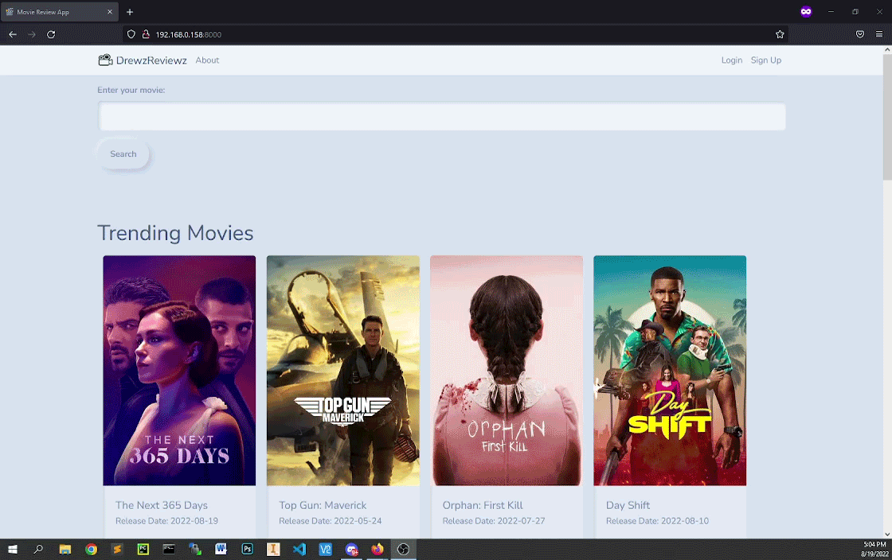

# DrewzReviewz #

# Demo
<p align="center">

</p>
<p align="center">
Live Demo: <a href="">DrewzReviewz</a></br>
[live demo may be down due to hosting costs]
</p>

# Introduction

DrewzReviewz is movie rating web application similar to IMDB. The featured critic is also the owner of this github project.

Tech Stack:
* Docker
* Django
* PostgreSQL
* TMDB API

Key Features:
* Search for specific movies
* Movie details page containing user reviews
* User Signup
* User rating/comment submission
* User profile page


## Configuration

Create .env file and populate with the following credentials
```bash
TMDB_KEY=<tmdb_api_key>
DB_NAME=<postgres_name>
DB_USER=<postgres_username>
DB_PASS=<postgres_password>
```

## Installation/Deployment

1. Install Docker Compose: https://docs.docker.com/compose/install/

2. Double check to make sure updated .env is in base directory

3. Run following command

```bash
sudo docker-compose run web django-admin startproject mr_django_app .
```

4. edit permissions

```bash
sudo chown -R $USER:$USER mr_django_app manage.py
```

5. edit settings.py and add to db section

```python
# settings.py
   
import os
   
[...]
   
DATABASES = {
    'default': {
        'ENGINE': 'django.db.backends.postgresql',
        'NAME': os.environ.get('POSTGRES_NAME'),
        'USER': os.environ.get('POSTGRES_USER'),
        'PASSWORD': os.environ.get('POSTGRES_PASSWORD'),
        'HOST': 'db',
        'PORT': 5432,
    }
}
```

6. Run it
```bash
docker-compose up -d
```


## Contributing
Feel free to fork my work. This project is not actively maintained.

## Maintainers
Andrew Johnson

## License
[MIT](https://choosealicense.com/licenses/mit/)